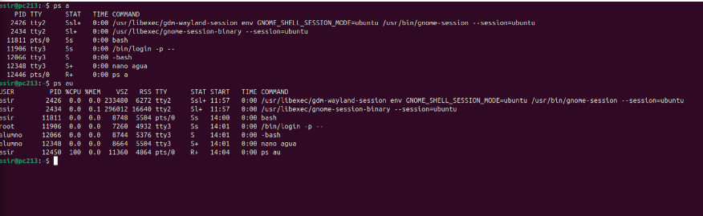
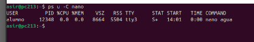
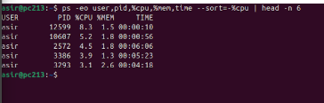
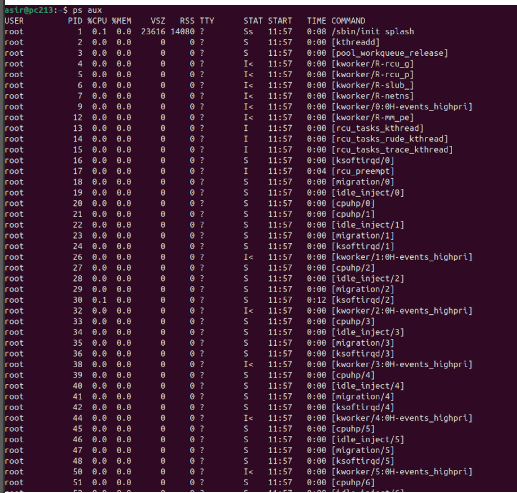
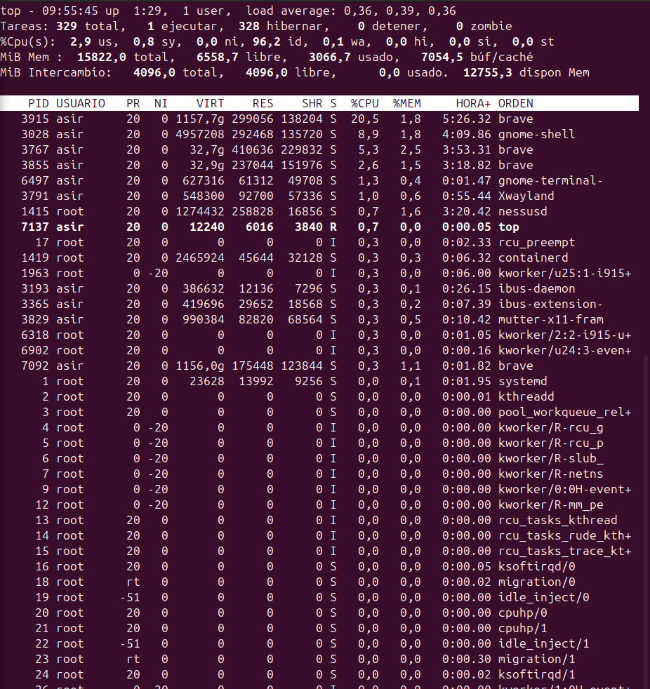

### 1. Process
```
ps <aux>
ps <aux -S>
ps <aux -T>
ps <u -C "ProcessName">
ps <-eo user,pid,%cpu,%mem,time --sort=%$cpu | head -n 6>
top ( control + m = order by memory, control + p = order by cpu, EXIT = q )
htop
atop (It has his own file, /etc/default/atop)
```
#### PS

PS (Process system) it becomes with the system, and it can show the process of the system and process of the user.

Concepts:
In process, we need to know some concepts that maybe we can see it in the shell and dont know what it means:
1. USER: User who started the process.
2. PID: Process identification.
3. %CPU: CPU Usage.
4. %MEM: Memory Usage.
5. TTY: Terminal that is running that process.
6. STAT: Status of the process.
   a. Sleeping (S): Currently unactive.
   b. Running (R): Currently running.
   c. Stopped (T): Indicates a stopped process.
8. START: Time it has started the process.
9. TIME: Time it has been running since started.

Examples of ps a (It shows a page that shows all the process generated manually by the user.):


`ps u -C nano>`
(u: means users, and -C is an option we can use to search the process, in this case for example, nano.)



`<ps -er user,pid,%cpu,%mem,time --sort=%cpu | head -n 6`

(-er: shows only the columns of the table of PS that we want, lice user, pid, cpu usage and memory usage. --sort=%cpu: it shorts the process by cpu, by the most use to the lowest. head -n 6: only show the 6 firsts)



PS AUX: (It shows a page that shows all the process generated by te root, in the TTY section has an "?", it means it is executing the process in the background, we can do that with any process, just putting at the end of the command &&)



TOP: Similar to PS,, but it adds a header and runs like a program, taking the shell as an interactive way to show all the process in the system:



### 2. Memory Ram

```
free <-h, -s 3>
```

### 3. Hard disks
```
df -h <Directory>
du <-hs> <Directory>
iostat <-m, -h, -x> <Hard Disk Device>
iostat <-3> <Hard Disk Device>
iostat <-s, -x 1> <Hard Disk Device>
```
### 4. Network
```
tcpdump <-i> <Ethernet> <-w> <"Recording File Name">
tcpdump <-r> <"File Name Recorded"> | grep -w <"Service name of the output">
tcptrack <-i> <Ethernet>
iptraf (Graphical interface)
bmon (Another graphical interface)
