# System tools (to monitorize your computer completely)

## Process system

PS (Process system) it becomes with the system, and it can show the process of the system and process of the user.

Concepts:
In process, we need to know some concepts that maybe we can see it in the shell and dont know what it means:
1. USER: User who started the process.
2. PID: Process identification.
3. %CPU: CPU Usage.
4. %MEM: Memory Usage.
5. TTY: Terminal that is running that process.
6. STAT: Status of the process.
   a. Sleeping (S): Currently unactive.
   b. Running (R): Currently running.
   c. Stopped (T): Indicates a stopped process.
8. START: Time it has started the process.
9. TIME: Time it has been running since started.

Examples of ps a (It shows a page that shows all the process generated manually by the user.):

`ps u -C nano>`
(u: means users, and -C is an option we can use to search the process, in this case for example, nano.)

`<ps -er user,pid,%cpu,%mem,time --sort=%cpu | head -n 6`

(-er: shows only the columns of the table of PS that we want, lice user, pid, cpu usage and memory usage. --sort=%cpu: it shorts the process by cpu, by the most use to the lowest. head -n 6: only show the 6 firsts)

PS AUX: (It shows a page that shows all the process generated by te root, in the TTY section has an "?", it means it is executing the process in the background, we can do that with any process, just putting at the end of the command &&)

`ps aux`

TOP: Similar to PS, but it adds a header and runs like a program, taking the shell as an interactive way to show all the process in the system, the header shows things like users, all the process, how much CPU and mem uses:

Shortcuts (Graphical):
Control + M: Order by Memory
Control + p: Order by CPU
Control + P: Order by PID (Process Identification)
Q: Exit

Also, you can use top without enter the graphical interface, by using -b, it does not syncronice automatically, it shows only a page in the exact moment you execute it.

here's an example:
`top -b -o %CPU -n 3 | head -n 17 > 10procesos.txt`
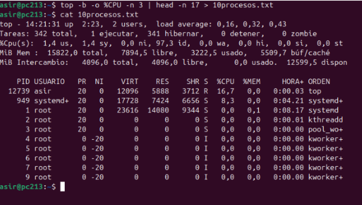

HTOP: Also a more virsual than the others, down the page we have the shortcuts to help us (The users) find a process to kill, or exit the page.

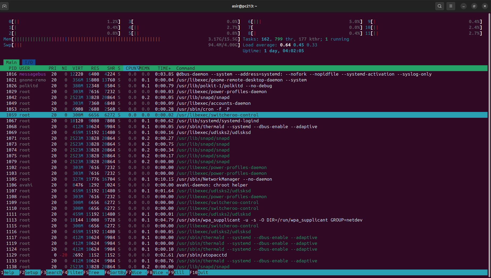

Shortcuts:
- F1: Help (Shows the man page to learn more)
- F2: Setup (Edit the config file)
- F3: Search (Search process)
- F4: Filter (Filter by CPU, Memory...)
- F5: Tree (Show the page like a tree)
- F6: Sort by (Order the page)
- F7: Nice - (Scroll down the page)
- F8: Nice + (Scroll up the page)
- F9: Kill (Kill the process)

ATOP: Another visual way to show all the process.

We can edit the file using `nano /etc/default/atop`

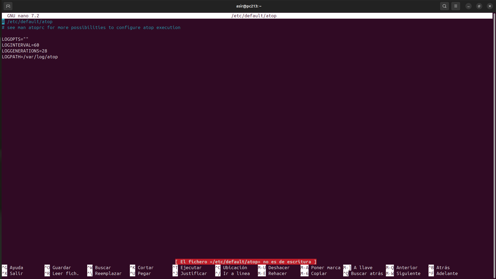

And we can restart the service with `systemctl restart atop`

## Memory

FREE: We can check the usage of the memory.

`
free (Shows memory in bytes)
free -h (Shows memory in GB)
free -s 3 (Shows memory every 3 seconds)
`

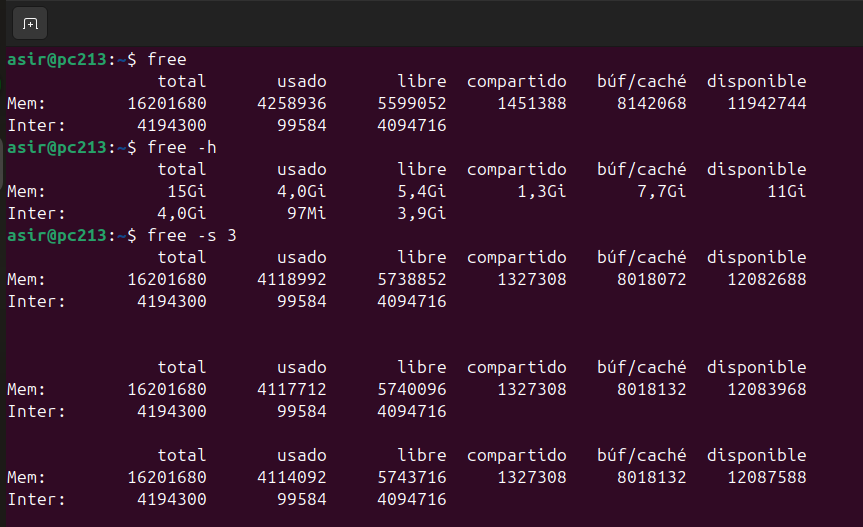

## Hard disks

DF: Shows all the disk (even the pendrives, that are mounted in the system)

` df (Shows all the mount points in KB) `

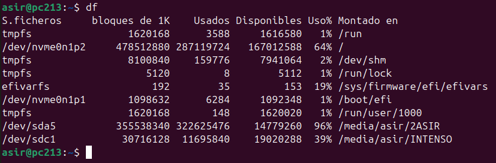

df -h (Shows all the mount points in GB)

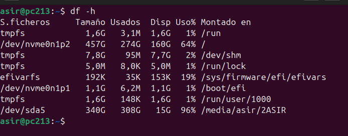

DU: List all the archives in the directory and gives the space.

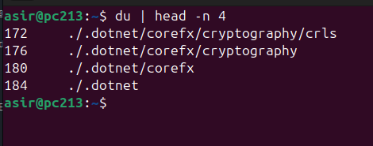

du -hs / <Directory>: List all the archives in a directory, and gives us the information about the space it has.

-hs(H is for know in GB,MB or KB are the directory, and -s to know the total and not list all the directory from inside.)

Example:

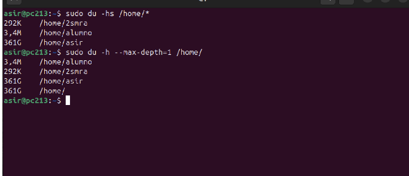

IOSTAT:Is a command that gives us three type of stadistics, wich is about CPU, Hard disk device, and partitions.

CPU Statistics:

%user: Percentage of time the CPU spends executing processes in user space.
%nice: Percentage of time the CPU spends executing processes with adjusted priority (nice).
%system: Percentage of time the CPU spends executing processes in kernel space.
%iowait: Percentage of time the CPU spends waiting for I/O operations to complete.
%steal: Percentage of time stolen by virtual machines in a virtualized environment.
%idle: Percentage of time the CPU is idle.

Example:
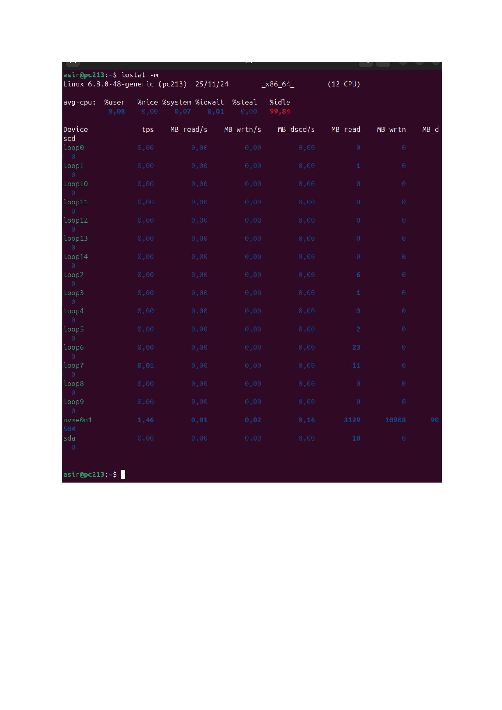

We can use `iostat -mh` to show all the stadistics in kb, mb or gb, and also we can use `iostat -xh <Hard disk device` to show if it's currently working, speed of download and upload and more.

Examples:

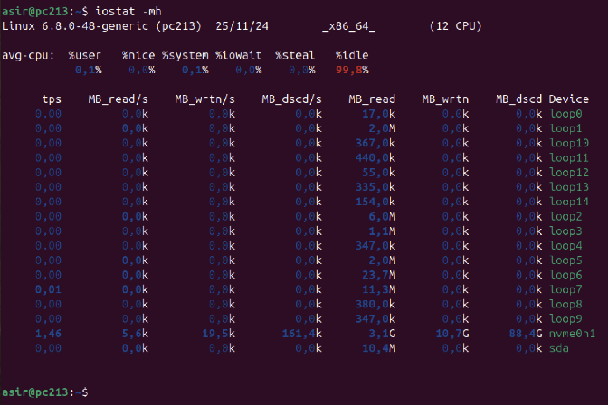
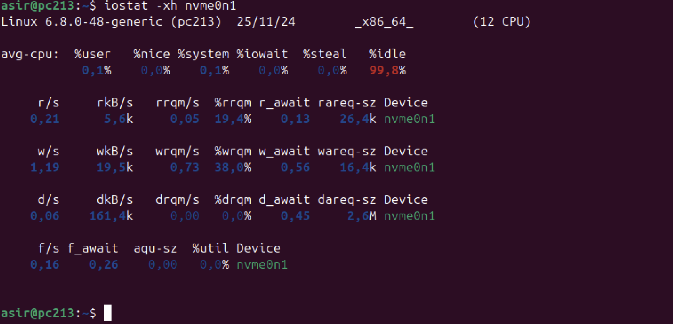

We can also select the number of columns the program shows to us with `iostat -s "Number"`.

Example:

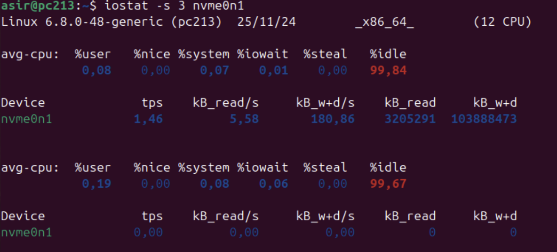

# Network

For this, we will need the use of root privileges, because otherwise we wont get anything.

TCPDUMP: It's a program, like wireshark, that shows all the trafic in our network

If we want to only select our network trafic, we have to use `tcpdump -i <Network Adapter>`.

We can see our network adapter using `ip a`, it shows the IP of our network, and also the name of the Network adapter, or "Ethernet".

Examples:

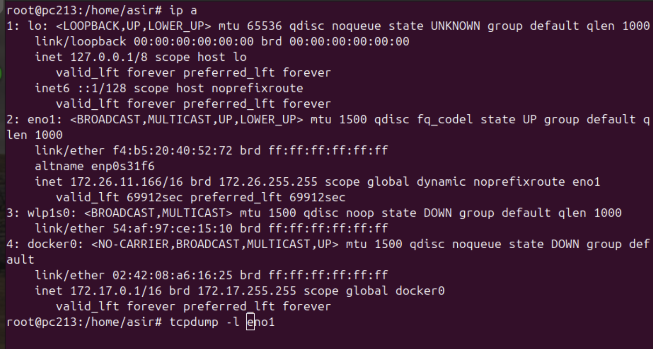
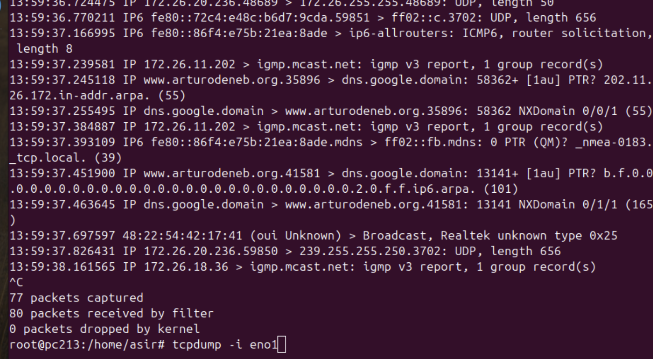

We can also redirect (like `echo "Hello world! > helloW.txt"`) with -w, but we will have some trouble at the time to read te file, because when it generates the file, the creator and group are tcpdump and not root, so we will have to change that.

To read the file, just use `tcpdump -r <File>`, otherwise, using cat, we will se that is encrypted.

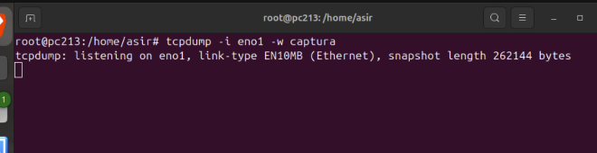
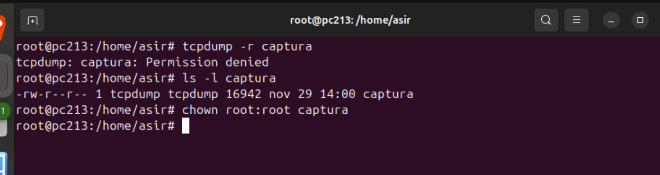
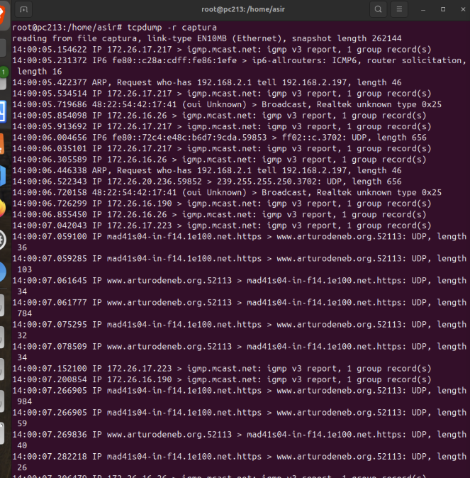

We can also filtrare the outpost, with `tcpdump | grep -w "SomethingYouWannaSee"`, in this case, i have apache2 working with the name arturodeneb.org.

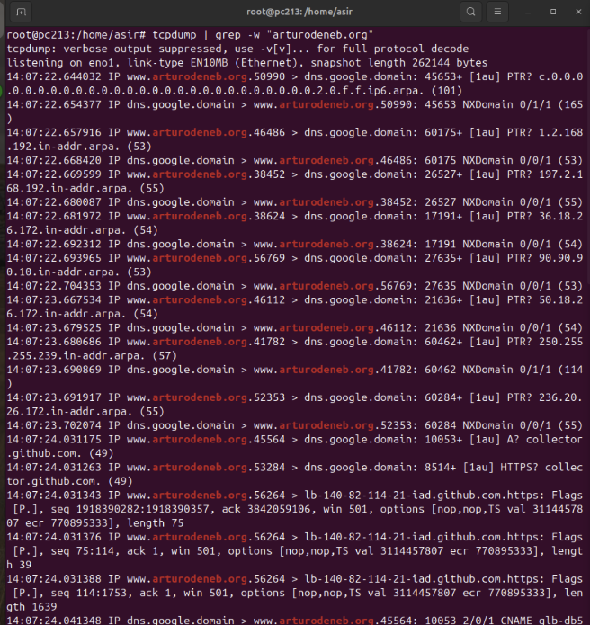

TCPTRACK: It shows a live outpost that are the actual open conexion established with a server, or with a service.

`tcptrack -i <Ethernet adapter>`
It tracks all the chanels established with the ethernet conexion and the server.

Example:

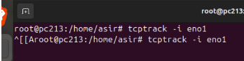
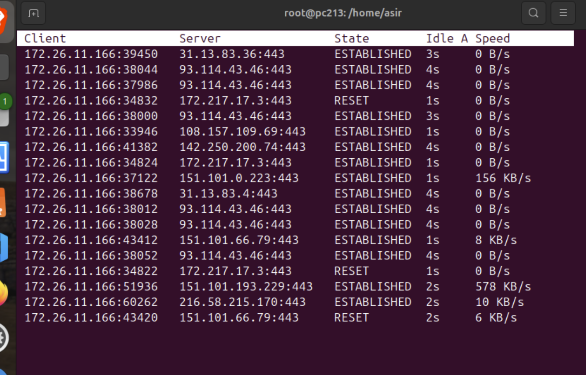

[Previews page](introduccion.md) --- [Next page](sistemas.md)
